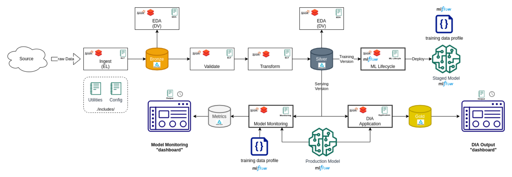

# Forecasting Flight Delay Project

## I. Description
- Developing an end to end Data Intensive Application (DIA) that predicts flight delays using 6 years of US flight recording data along with  hourly weather reports.
  - <a href='https://transtats.bts.gov/Fields.asp?gnoyr_VQ=FGJ&flf_gnoyr_anzr=g_bagVZR_eRcbegVaT&h5r4_gnoyr_anzr=er2146v0t%20Pn44vr4%20b0-gvzr%20cr4s14zn0pr%20(EMLK-24r5r06)&lrn4_V0s1=E&Sv456_lrn4=EMLK&Yn56_lrn4=FDFE&en6r_V0s1=D&S4r37r0pB=Z106uyB&Qn6n_S4r37r0pB=N007ny,d7n46r4yB,Z106uyB'>Flight Delay Data Description</a>
  - [Hourly weather reports Data Description](https://www.ncei.noaa.gov/data/global-hourly/doc/isd-format-document.pdf)

Below are the illustrations of the different activities that factor into the total amount of time required for a flight and whether a given flight adheres to its scheduled departure and arrival times as well as the familiar process and tech stack

## II. Project Structure

- Repository Structure:
  - `DBC Archive` - Folder contains .dbc files of the project
  - `ML Flow` - Folder contains the results of the ML Flow Experiments
  - `DSCC202-402 Forecasting Flight Delay Final Project.html` - Project Description
  - `1_EDA.html` - EDA process of the project
  - `2_ETL.html` - ETL process of the project
  - `3_ETL_Streaming.html` - ETL Streaming process
  - `Modeling*.html` - Modeling process
  - `7_Monitoring.html` - Monitoring process of the application
  - `8_Application.html` - The final application

## III. Installation

1. Create a [Databricks](https://databricks.com/) account
2. Download the project and import it into the Databricks notebook

## IV. Contact

- Contributors:
  - [Hoang Le](hle7@u.rochester.edu) 
  - [Christopher Moore](Christopher_Moore@urmc.rochester.edu)
  - [Loc Bui](lbui3@u.rochester.edu)

- Feel free to contact us with any questions, comments, suggestions, bug reports, etc...